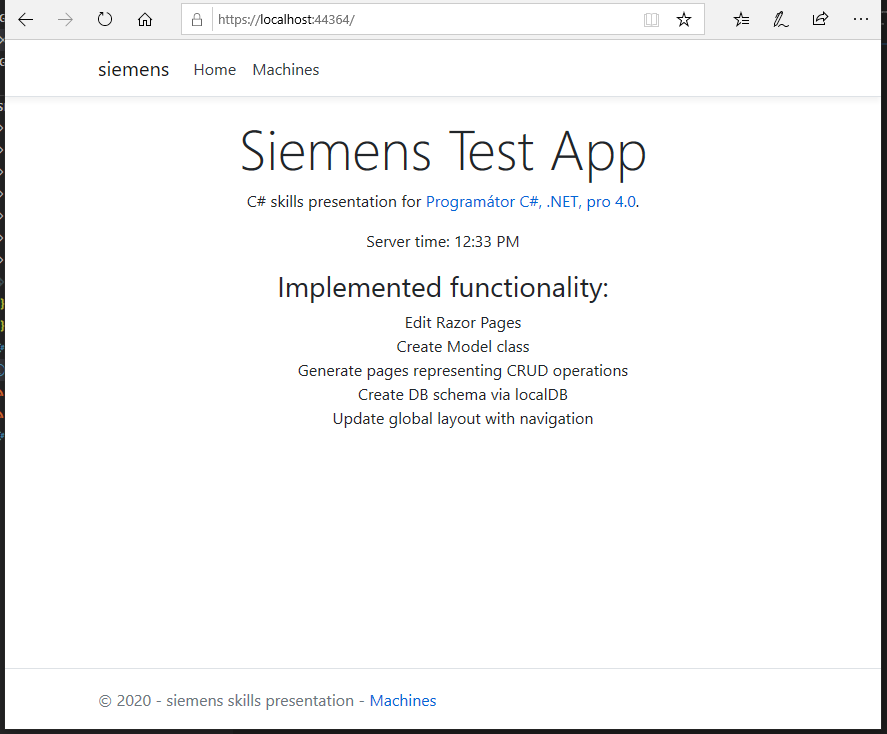

# Siemens

Presentation of tech abilities in mobile application development.

## Implemented functionality
   
- Edit Razor Pages
- Create Model class
- Generate pages representing CRUD operations
- Create DB schema via localDB
- Update global layout with navigation

## CRUD operations

- list all machines

- create machine

- edit machine

- delete machine
- machine detail

